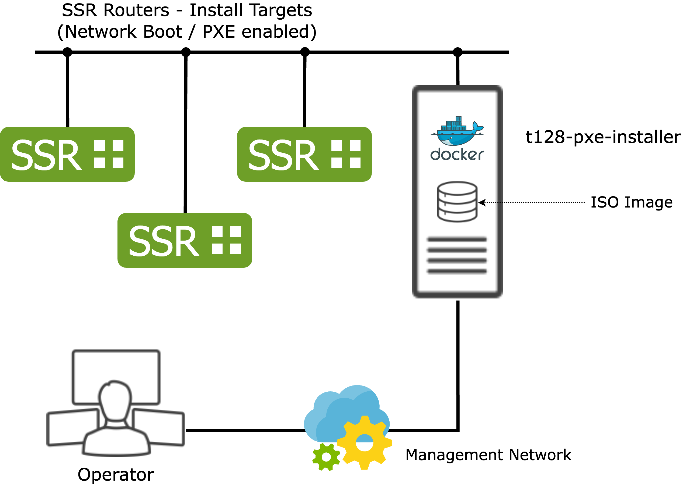

# t128-pxe-installer

Install SSR software over the network using ISO images.

## Design Goals

* Simple - only a docker container with two daemons for DHCP/TFTP and HTTP
* Easy to adjust - one script that contains most of the logic `entrypoint.sh`
* Supports package based (PBU) and image based (IBU) SSR images

## Topology



## Setup

### Preparation

```
git clone https://github.com/majes-git/t128-pxe-installer.git
cd t128-pxe-installer
echo BLASTING_INTERFACE=eth1 > .env
```

### Run with Docker-compose

```
docker-compose up -d
```
### Run with Docker
```
docker build -t t128-pxe-installer .
docker run -it -v ./iso:/iso --env-file .env --network host --privileged --rm t128-pxe-installer
```

## ISO Image Selection

By default the entrypoint.sh script looks for the first `.iso` file in the mounted `/iso` volume of the docker container.

If there are more ISO images in the `/iso` directory, the source image can be specified in the `ISO_IMAGE` environment variable:

```
echo ISO_IMAGE=128T-6.2.5-5.r2.el7.OTP.v1.x86_64.iso >> .env
```
By default, the `iso` directoy in the project folder is used to mount it as the `/iso` volume to the container. This can be changed using the `ISO_DIR` variable in `.env`:

```
echo ISO_DIR=/mnt >> .env
```

After changing the `.env` file the docker container requires a restart:

```
docker-compose down && docker-compose up -d
```

## Developer Notes

* The container uses Alpine Linux for a small footprint
* On top of it the daemons dnsmasq (for DHCP and TFTP = PXE) and gatling (a small and very fast webserver) is added
* The ISO image is loop mounted inside the container and an overlay for additional files is created
* Gatling runs on this overlayed, loop mounted iso folder
* For the legacy (kickstart based) PBU installer, the `ks-otp.cfg` is adjusted for HTTP netboot
* For the IBU installer the `updates.img` (which is automatically loaded by dracut) adds a script to the LiveOS installer. This script fetches the image and installation scripts (`*.ibu-v1.tar`, `install.sh` and `unpacker.sh`):

```
$ unsquashfs -l /srv/www/iso/images/updates.img
squashfs-root
squashfs-root/download_installer.sh
squashfs-root/etc
squashfs-root/etc/systemd
squashfs-root/etc/systemd/system
squashfs-root/etc/systemd/system/anaconda.service.d
squashfs-root/etc/systemd/system/anaconda.service.d/override.conf
```

## Changes

### 2024-07-24

* Added support for UEFI
